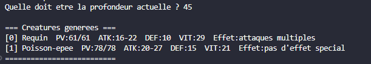
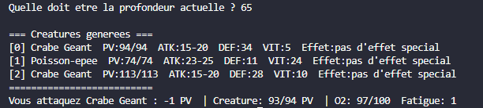

# Progression — OceanDepth

## Étapes réalisées

- [x] **Étape 1 — Génération de créatures marines** (Fait par Sandor)
  - Structure `CreatureMarine` créée.
  - Génération aléatoire du nombre et du type de créatures selon la profondeur.
  - Affectation dans un tableau fixe (pas d’allocation dynamique).
  - Fonction `afficher_creatures()` pour vérifier la génération en console.

- [x] **Étape 2 — Attaque du plongeur** (Fait par Thomas)
  - Structure `Plongeur` mise en place.
  - Gestion des ressources (PV, oxygène, fatigue).
  - Fonction `attaquer_avec_harpon()` : calcul des dégâts + consommation O₂ + fatigue.
  - Premier test d’interaction joueur → créature via affichage console.

- [ ] **Étape 3 — Attaque des créatures**
  - Gestion des tours de riposte selon la vitesse.
  - Effets spéciaux des créatures (Kraken, Méduse, Requin…).
  - Interaction complète joueur <-> créatures.
  - Boucle de combat à implémenter.

- [ ] **Étape 4 — Système de récompenses**
  - Récompenses après combat (perles, objets, harpons).
  - Début de gestion d’inventaire (`inventaire.c/h`).

- [ ] **Étape 5 — Sauvegarde et chargement**
  - Sauvegarde de l’état complet du joueur.
  - Lecture/écriture de fichier texte (`saves/`).

- [ ] **Étape 6 — Compétences aquatiques**
  - Implémentation des compétences du joueur (apnée, décharge électrique…).

- [ ] **Étape 7 — Cartographie des océans**
  - Déplacement entre zones, affichage de carte simplifiée.

---

## Captures d’écran

### Étape 1 — Génération de créatures

### Étape 2 — Attaque du plongeur

---

## Difficultés rencontrées

- Problèmes d’accents sur Vs-code (résolus en retirant les caractères accentués dans le code source).

